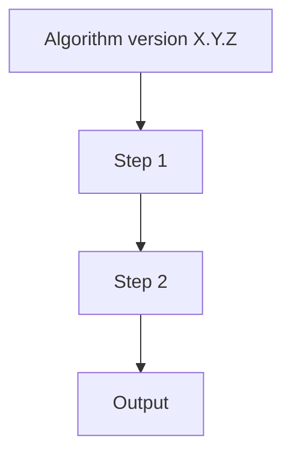

# Logic Diagram

> Replace this placeholder with a Mermaid diagram of the algorithm version
> captured in this snapshot. Obsidian will render Mermaid blocks inline.

## Notes

- Annotate every threshold with `[T]` (tunable), `[F]` (feature-definition-limited), or `[S]` (structural constant).
- Match the style of existing diagrams in `src/mousereach/docs/algorithm_diagrams/`.
